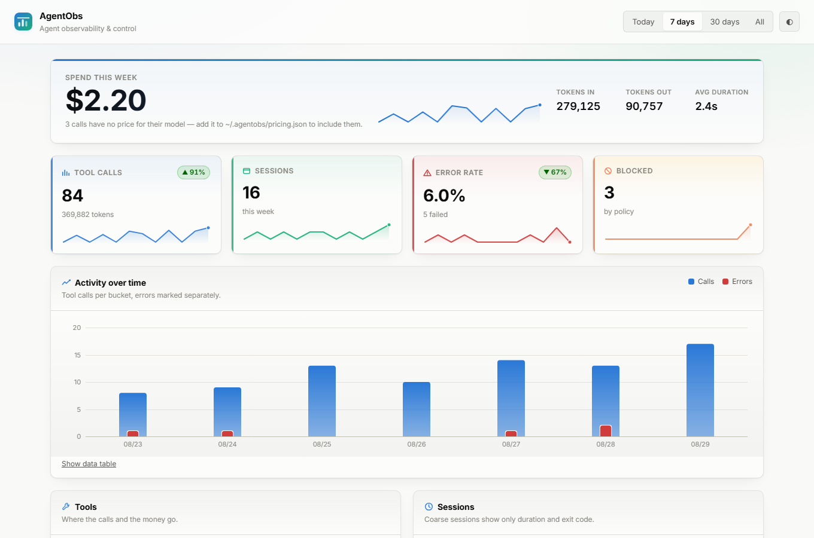
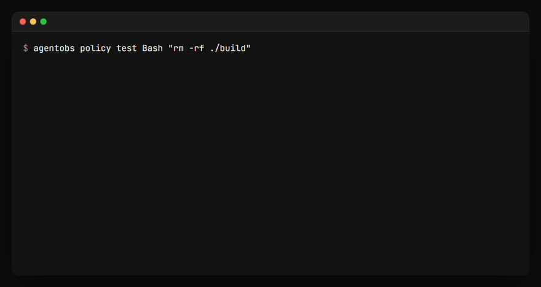

<div align="center">


# AgentObs

**Stop your AI agent before it spends too much or breaks something.**

[](https://www.npmjs.com/package/@klars/agentobs)
[](LICENSE)
[](https://nodejs.org)

[Website](https://agents.klars.ai) · [npm](https://www.npmjs.com/package/@klars/agentobs) · [Contributing](CONTRIBUTING.md)

</div>

<br>

<picture>
  <source srcset="docs/assets/dashboard-dark.png" media="(prefers-color-scheme: dark)" />
  
</picture>

<br>

## The only agent tool that can say no

Every other Claude Code tool is read-only — they tell you what happened
*after* it happened. AgentObs is a control plane: it sets limits and enforces
them before a call runs.

```
$ agentobs budget set --daily 5 --block
$ agentobs policy test Bash "rm -rf ./build"

  Decision   BLOCK
  Rule       no-recursive-force-delete
```



| | Cost tools | Security hooks | **AgentObs** |
| --- | --- | --- | --- |
| Cost & token reporting | ✅ | ❌ | ✅ |
| Web dashboard | ❌ | some | ✅ |
| Blocks dangerous commands | ❌ | ✅ | ✅ |
| **Blocks on a spend limit** | ❌ | ❌ | ✅ |
| **Blocks on your 5-hour window** | ❌ | ❌ | ✅ |
| Secret redaction, unit-tested | ❌ | ❌ | ✅ |

**Just want cost reporting?** [ccusage](https://github.com/ryoppippi/ccusage) is
excellent at it and supports 16+ agents. AgentObs is for when you want to
*stop* things, not only measure them.

AgentObs runs entirely on your machine: a CLI, a local SQLite database, and a
dashboard. No account, no cloud, no telemetry.

## Quick start

```bash
npm install -g @klars/agentobs
agentobs init
agentobs import
```

`import` reads Claude Code's own session transcripts from `~/.claude/projects/`
and backfills everything you have already done — no configuration, no hooks.
Then:

```bash
agentobs dashboard
```

That is the fastest path to real data, and the one to try first.

### Live capture (optional)

`import` is after-the-fact. To record calls **as they happen** — and to let
guardrails actually block them — add the hook configuration that
`agentobs init` prints to `~/.claude/settings.json`, then restart Claude Code.

> **If hooks record nothing:** this has been observed on at least one Windows
> install, where Claude Code did not invoke the configured command at all — a
> plain two-line `.cmd` file also never fired, so it is not specific to
> AgentObs. Check by running any tool and then `agentobs stats --today`. If it
> stays at zero, keep using `agentobs import`, which needs no hooks; only
> guardrail *blocking* depends on them.

---

## What you get

|                        |                                                              |
| ---------------------- | ------------------------------------------------------------ |
| **Budget limits**      | Warn or **hard-block** at a dollar or token limit — daily, weekly, monthly, or Claude's 5-hour window. |
| **Cost tracking**      | Per session, per tool, per project — or blank if the model's price is unknown. Never guessed. |
| **Tool-call timeline** | Every call, its duration, status, and truncated input.        |
| **Guardrails**         | Block `rm -rf`, require approval for `.env` edits, stop `curl \| sh`. |
| **Audit trail**        | Every policy decision recorded with the rule that fired.      |
| **Any agent**          | Native Claude Code hooks; JSONL ingestion or process-wrapping for everything else. |

---

## Privacy

This is the part that matters most, since AgentObs sits in the middle of
everything your agent does.

- **Nothing leaves your machine.** No network calls, no analytics, no account.
- **Secrets are redacted before anything is written to disk.** Tool inputs and
  outputs pass through a redaction layer that recognises AWS keys, Anthropic /
  OpenAI / GitHub / GitLab / Slack / Stripe / Google / npm tokens, JWTs, PEM
  private keys, `KEY=value` assignments, `--flag secret` arguments,
  `Authorization:` headers, and credentials embedded in URLs.
- **Summaries are truncated** to ~500 characters.
- The redaction rules are unit-tested in
  [`src/core/redact.test.ts`](src/core/redact.test.ts) — the tests are the
  guarantee, and they have caught real leaks during development.

Everything lives in `~/.agentobs/`. Uninstalling is `rm -rf ~/.agentobs`.

---

## Commands

```
agentobs init                        Set up ~/.agentobs and print the hook config
agentobs import [--days n] [--all]   Import Claude Code transcripts (no hooks needed)
agentobs dashboard [--port] [--host] Serve the dashboard (default 127.0.0.1:4300)
agentobs stats [--today] [--since]   Print totals in the terminal
agentobs run -- <command...>         Observe any command (coarse detail)
agentobs watch <file.jsonl>          Ingest a JSONL agent log
agentobs export --format csv|json    Export sessions, tool calls, or decisions

agentobs policy init                 Write a starter policy.json
agentobs policy check                Validate it and list active rules
agentobs policy test <tool> <input>  Dry-run a call against the policy

agentobs budget                      Spend and token use against your limits
agentobs budget set --daily 5        Warn past $5 today
agentobs budget set --monthly 100 --block        Stop at $100 this month
agentobs budget set --block5h 200000 --tokens    Watch your 5-hour window

agentobs digest                      A readable period summary
agentobs projects                    Spend grouped by working directory
```

---

## Budgets

The feature nothing else has: a limit that actually stops the agent.

```bash
agentobs budget set --daily 5                    # warn
agentobs budget set --monthly 100 --block        # stop at $100
agentobs budget set --block5h 200000 --tokens    # 5-hour window
```

```
  Budget       Spent       Limit   Used  Action
  ------------------------------------------------------------
  block5h      120K tok    200K tok   60%  warn
  [############........]
  daily           $0.66       $5.00   13%  warn
  [###.................]
```

With `--block`, a crossed limit denies further tool calls through the same
PreToolUse hook the guardrails use — the agent is told why, and the decision is
recorded in the audit trail.

**On a subscription plan, dollars are the wrong unit.** What bites is the
rolling 5-hour session window and the weekly cap. `--tokens` denominates a
budget in tokens, and `--block5h` tracks that window, so you can see a lockout
coming instead of hitting it mid-task.

Alerts fire once per period, not once per tool call.

---

## Guardrails

`agentobs policy init` writes `~/.agentobs/policy.json`:

```json
{
  "rules": [
    {
      "name": "no-recursive-force-delete",
      "match": { "tool": "Bash", "command_pattern": "*rm -rf*" },
      "decision": "block",
      "message": "Recursive force-delete is blocked by AgentObs policy."
    },
    {
      "name": "protect-env-files",
      "match": { "tool": "*", "path_pattern": "**/.env*" },
      "decision": "needs_approval"
    }
  ],
  "default_decision": "allow"
}
```

Rules are evaluated top to bottom; **the first match wins**, so you can put a
narrow `allow` above a broad `block`. Check what a rule will do *before* it
fires mid-task:

```bash
$ agentobs policy test Bash "rm -rf ./build"

  Tool       Bash
  Input      rm -rf ./build
  Decision   BLOCK
  Rule       no-recursive-force-delete

  This call would be BLOCKED before running.
```

Two deliberate behaviours worth knowing:

- **`needs_approval` currently behaves as a block** with a clearer message.
  There is no channel for a hook to prompt you interactively mid-call.
- **A broken policy file fails open.** Invalid JSON or a malformed rule
  degrades to allow-everything and reports the problem, because a guardrail
  that wedges your agent is worse than no guardrail. Run `agentobs policy check`.

---

## Agent support

| Agent | How | Detail | Needs setup? |
| --- | --- | --- | --- |
| **Claude Code** | `agentobs import` | **Rich** — every tool call, tokens, cost | **No** |
| **Claude Code** | Native hooks | **Rich**, live, and can *block* calls | Yes — hook config |
| Any CLI agent | `agentobs run -- <cmd>` | **Coarse** — duration and exit code only | No |
| Custom / in-house | `agentobs watch <file>` | **Rich**, if it writes JSONL | No |

`import` and hooks read the same underlying data. The difference is timing:
hooks see a call *before* it runs, which is what makes blocking possible;
`import` reads the transcript afterwards. If you only want observability,
`import` is enough and needs no configuration.

The dashboard labels coarse sessions as `coarse` rather than implying detail it
does not have, and `agentobs stats` explains why a coarse-only range shows zero
tool calls.

### A note on cost accuracy

Claude Code's `PostToolUse` hook payload carries **no token or cost fields**,
so token usage comes from the session transcript — at `SessionEnd` for hooks,
or directly via `agentobs import`. That makes **session-level cost accurate**
while leaving **per-tool-call cost blank**: usage is reported per assistant
message, not per tool call, and dividing a total across calls would be a
manufactured number.

**Cache tokens dominate a long session.** A cached conversation replays its
whole context on every turn, so `cache_read` can reach hundreds of millions of
tokens in a single session. AgentObs tracks cache reads (billed at 0.1x input)
and cache writes (1.25x) separately from fresh tokens, and `agentobs import`
prints the four lines separately — a single unexplained total looks like a bug
when the cache line legitimately dwarfs everything else.

Model prices live in `~/.agentobs/pricing.json` and are yours to edit. A model
missing from that file shows cost as `—`, never `$0.00`.


### Hook latency

The hook does its own work in **well under 1ms** (measured: ~0.3ms per
invocation, including the SQLite write). What you actually pay per tool call is
**Node.js process startup**, since Claude Code spawns the hook as a fresh
process each time.

On a typical Linux/macOS machine that is ~40-80ms. On Windows with real-time
antivirus scanning it can reach **1-1.5 seconds** - and that cost is not
specific to AgentObs: a bare `node -e "0"` measures the same. Check yours with:

```bash
node -e "0"          # time this; it is the floor for any Node-based hook
```

If it is slow, adding an exclusion for your Node install directory and
`~/.agentobs` in your antivirus settings is the fix. There is no code change
that avoids it - the cost is paid before AgentObs runs at all.

---

## Dashboard access

Binds to `127.0.0.1` with no authentication — same machine, same user, same
trust boundary as the database file.

Binding anywhere else **requires a token**, printed at startup and included in
the URL:

```bash
agentobs dashboard --host 0.0.0.0
```

**Never expose the dashboard to the public internet.** It shows tool inputs and
file paths from your repositories.

---

## Requirements

Node.js **≥ 22.5** — AgentObs uses the built-in `node:sqlite` module, so there
is no native addon to compile and no C++ toolchain to install.

---

## Development

```bash
npm install
npm run build
npm test
```

Adding an adapter for another agent: see [CONTRIBUTING.md](CONTRIBUTING.md).

---

## License

MIT © [Klars AI](https://klars.ai)
